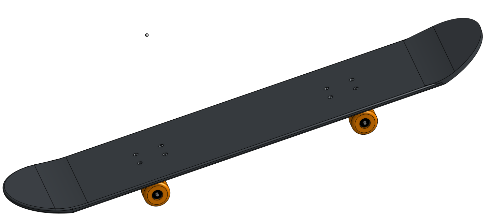
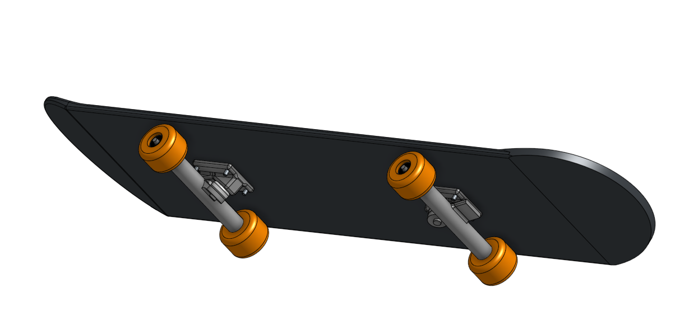

# Skateboard
In this assignment, I built a skateboard in CAD

## Description
---
We're building a skateboard. First, we started by building the deck, which was simple, and we also added some screw holes. Then, we worked with the trucks. One of the main objectives of this assignment was to work smarter not harder. We first started this part by building a basic square version of it (not accurate IRL), then we made some easy adjustemnts to that at the end to make it more like real trucks (angled). After this, a couple other simple parts and the board was done. We also changed the color, and it looks ike a pretty awesome skateboard in CAD.

## Link
---
[Click here to see my CAD skateboard](https://cvilleschools.onshape.com/documents/75e69f9d6256cc7ddbb624e5/w/b731cf0f768f7077a37c7843/e/a826b4f162ec3ae95ba6cc64?renderMode=0&uiState=616446d80700fc66f85bb17a)

## Image
---

